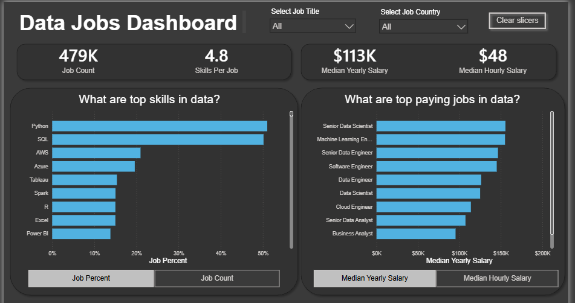

# Data Jobs Dashboard V2

## Introduction
This project offers a streamlined single-page interface to quickly explore crucial market trends. [3]

## Skills Showcased
- **Dashboard Design**
- **Data Transformation (ETL with Power Query)**
- **Data Modeling (Star Schema)**
- **DAX (Data Analysis Expressions)**
- **Visualizations (Charts, Cards, Tables, etc.)**
- **Interactive Reporting (Slicers, Buttons, Bookmarks, and Drill-through)** [3, 4]

## Dashboard Overview
### Page 1 High-Level Market View

